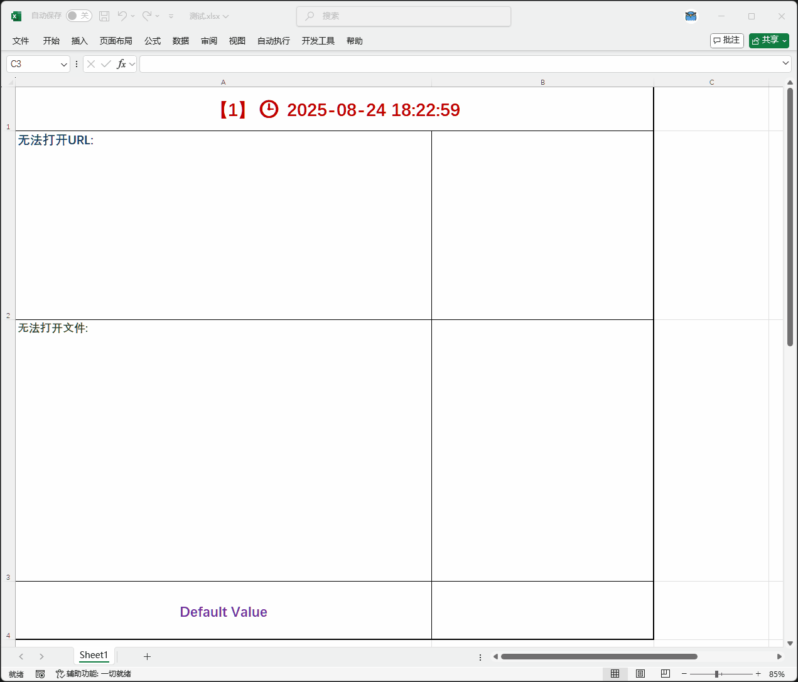

# RTDServer

一个基于 C++ 开发的 RTD (Real-Time Data) 服务器，支持为 Microsoft Excel(64位) 和 WPS(32位) 提供实时数据服务。该项目实现了 Excel RTD 接口，支持多种数据源和自定义任务。




## 🚀 项目特性

- **Excel RTD 兼容**: 实现 Microsoft Excel RTD 接口规范
- **自定义任务**: 支持时钟、文件读取、网页抓取、命令执行等多种操作
- **异步处理**: 支持异步任务执行，提高性能
- **COM 组件**: 作为 COM 组件可被 Excel 或其他应用程序调用
- **多线程安全**: 支持多线程环境下的数据更新
- **实时更新**: 自动通知 Excel 数据变化

## 📁 项目结构

```
RTDServer/
├── CMakeLists.txt         # CMake 构建配置
├── IRTDServer.h           # RTD 服务器接口定义
├── RTDTopic.h             # 主题类定义，管理数据项
├── RtdServer.h            # RTD 服务器类声明
├── RtdServer.cpp          # RTD 服务器核心实现
├── RtdDll.cpp             # DLL 入口点和 COM 注册
├── RtdDll.def             # DLL 导出函数定义
├── main.cpp               # 任务创建和数据处理逻辑
├── Test.cpp               # COM 组件测试程序
└── README.md              # 项目说明文档
```

## 🛠️ 技术栈

- **语言**: C++20
- **构建工具**: CMake 3.10+ / Ninja (可选)
- **平台**: Windows (主要)
- **编译器**: MSVC (推荐) / GCC (MSYS2 mingw-w64)
- **架构**: COM 组件 + DLL

## 📋 系统要求

### 开发环境
- CMake 3.10 或更高版本
- Ninja 构建系统 (可选，用于更快的增量构建)
- C++23 兼容的编译器 (MSVC 2022+ 或 GCC 11+)
- Windows 开发环境 (推荐)
- Microsoft Excel (用于测试 RTD 功能)

### 运行环境
- Windows 7/10/11
- Microsoft Excel 2010 或更高版本
- WPS

## ⚡ 快速开始

### 1. 克隆项目
```bash
git clone https://github.com/mwmi/excel-rtd-server.git
cd RTDServer
```

### 2. 构建项目

#### 使用默认构建器 (MSBuild/Make)
```bash
mkdir build
cd build
cmake ..
cmake --build . --config Release
```

#### 使用 Ninja 构建器 (推荐，更快的构建速度)
```bash
mkdir build
cd build
cmake -G Ninja ..
ninja
```

#### 指定构建类型的 Ninja 构建
```bash
# Debug 构建
cmake -G Ninja -DCMAKE_BUILD_TYPE=Debug ..
ninja

# Release 构建
cmake -G Ninja -DCMAKE_BUILD_TYPE=Release ..
ninja
```

### 3. 注册 COM 组件

根据不同位数的 Excel 版本，选择对应的注册命令(注册com需要管理员权限)：

- 64位 Excel: `regsvr32 RTDServer64.dll`
- 32位 Excel: `regsvr32 RTDServer32.dll`
- WPS:        `regsvr32 RTDServer32.dll`

### 4. 在 Excel 中使用

在 Excel 单元格中输入以下公式：

```excel
=RTD("RTDServer","","clock")                      # 显示实时时钟
=RTD("RTDServer","","file","C:\path\to\file.txt") # 读取文件内容
=RTD("RTDServer","","web","https://example.com")  # 获取网页内容
=RTD("RTDServer","","cmd","dir")                  # 执行命令
=RTD("RTDServer","","path")                       # 获取当前路径
```

## 🎯 自定义功能示例

### 1. 显示时钟 (clock)
显示实时时间，每500毫秒更新一次
```excel
=RTD("RTDServer","","clock")
```

### 2. 文件读取 (file)
读取指定文件的内容
```excel
=RTD("RTDServer","","file","C:\data\info.txt")
```

### 3. 网页内容 (web)
获取指定网页的内容
```excel
=RTD("RTDServer","","web","https://api.example.com/data")
```

### 4. 命令执行 (cmd)
执行系统命令并返回结果
```excel
=RTD("RTDServer","","cmd","ipconfig")
```

### 5. 路径获取 (path)
获取当前工作目录
```excel
=RTD("RTDServer","","path")
```

## 🏗️ 核心架构

### 类图结构
```
IRtdServer (接口)
    ↑
RtdServer (实现类)
    ↓
Topic (数据主题管理)
```

### 主要组件

1. **RtdServer**: 核心服务器类，实现 RTD 接口
2. **Topic**: 数据主题类，管理单个数据项的生命周期
3. **Task**: 任务系统，支持同步/异步数据获取
4. **COM Factory**: COM 组件工厂，负责对象创建

### 数据流程
1. Excel 调用 `ConnectData` 创建数据主题
2. 服务器创建对应的 `Topic` 对象和任务
3. 后台线程执行任务，更新数据
4. 数据变化时通知 Excel 刷新
5. Excel 调用 `RefreshData` 获取最新数据

## 🔧 开发指南

### 添加新的数据源

1. 在 `main.cpp` 的 `createRtdTask` 函数中添加新的处理逻辑
2. 创建相应的任务函数
3. 设置任务属性（同步/异步、运行次数等）

示例：
```cpp
if (firstArg == L"custom") {
    topic->setTask([](Topic *topic) -> int {
        // 自定义数据获取逻辑
        topic->setValue(L"自定义数据");
        return 0;
    });
    return 0;
}
```

### 编译选项

- **Debug 模式**: 包含调试信息，便于开发调试
- **Release 模式**: 启用 LTO 优化，减小文件体积

## 🧪 测试

### Excel 测试
1. 注册 DLL: `regsvr32 RTDServer.dll`
2. 打开 Excel
3. 输入 RTD 公式测试各种功能
4. 观察数据实时更新

### 测试DLL是否注册成功

```bash
# 构建测试程序
cmake --build . --target test

# 运行测试
./test.exe
```

## 📝 配置说明

### CMake 配置选项
- `CMAKE_BUILD_TYPE`: 构建类型 (Debug/Release)
- `CMAKE_CXX_STANDARD`: C++ 标准版本 (23)
- `-G Ninja`: 使用 Ninja 构建器

### 性能调优
- 修改 `runing_ms` 调整更新频率
- 调整 `m_HeartbeatInterval` 设置心跳间隔
- 使用异步任务处理耗时操作
- 使用 Ninja 构建器提升开发效率

## 🔒 安全注意事项

- 命令执行功能存在安全风险，请在受控环境中使用
- 网页抓取功能需要网络权限
- 文件读取需要相应的文件系统权限

## 🐛 已知问题

1. WPS启动后不加载 DLL, 导致函数无法正常更新
2. 某些杀毒软件可能误报 DLL 文件
3. Excel 关闭时可能出现线程清理延迟
4. 大文件读取可能影响 Excel 响应性能

## 🤝 贡献指南

1. Fork 项目
2. 创建功能分支 (`git checkout -b feature/AmazingFeature`)
3. 提交更改 (`git commit -m 'Add some AmazingFeature'`)
4. 推送到分支 (`git push origin feature/AmazingFeature`)
5. 打开 Pull Request

## 📄 许可证

本项目采用 MIT 许可证 - 查看 [LICENSE](LICENSE) 文件了解详情

## 📞 联系方式

- 项目链接: [GitHub Repository]
- 问题反馈: [Issues]
- 文档: [Wiki]

## 🙏 致谢

- Microsoft RTD 接口文档
- CMake 社区
- Ninja 构建系统
- C++ 标准委员会

---

**注意**: README 为AI生成, 内容仅供参考。
